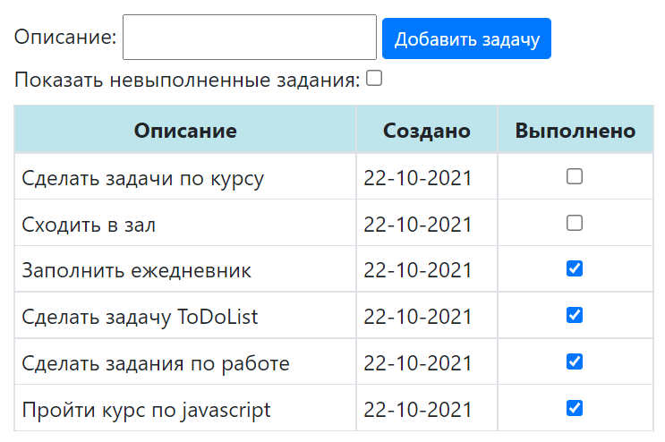
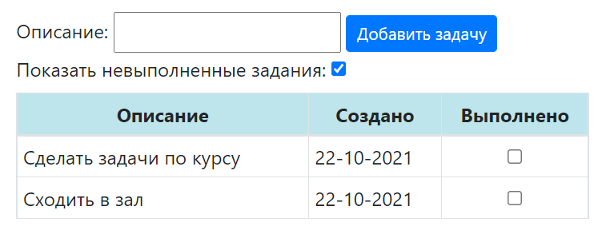

job4j_todo

## Приложение ToDo Список:

### Описание
Веб-приложение для постановки заданий и отметки об их выполнении.

### Технологии
- Java 15;
- Java EE Servlets;
- Hibernate;  
- PostgreSQL;
- Apache Maven;
- Apache Tomcat;
- HTML;
- JavaScript, jQuery, Bootstrap, JSON;

### Общий вид приложения

